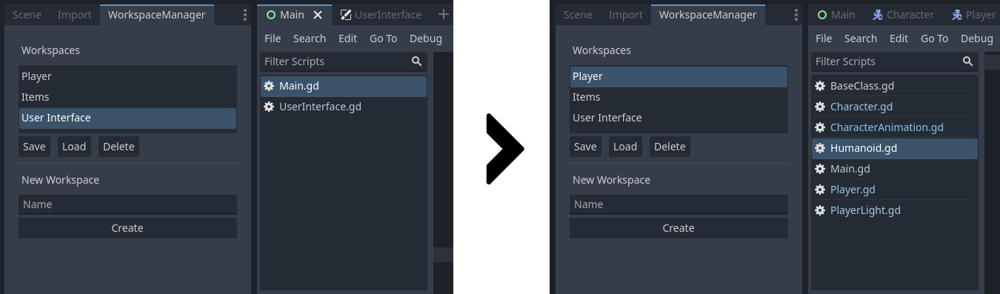

# Workspace Manager Plugin
A simple Godot 4.0 plugin for saving and loading your open script and scene tabs, so you can e.g. easily switch between contexts such as working on the GUI or on player stats, without the clutter of many open files.

A workspace keeps track of all open scripts and scenes, switching workspaces closes all current scenes and scripts and opens those saved in the workspace. Does not yet reopen Documentation tabs.
Not tested a lot yet so there might be bugs.

## Usage
 - Save your current state into a new workspace by entering a name in the text input under `New Workspace` and pressing the `Create` button.
 - Save changes in your open tabs to an existing workspace by selecting the workspace name and pressing the `save` button.
 - Load an existing workspace by selecting the workspace name and pressing the `Load` button.
	- Will save unsaved scenes and scripts and close all current tabs and files before loading the workspace.
 - Delete a workspace by selecting its name and pressing the `Delete` button.
